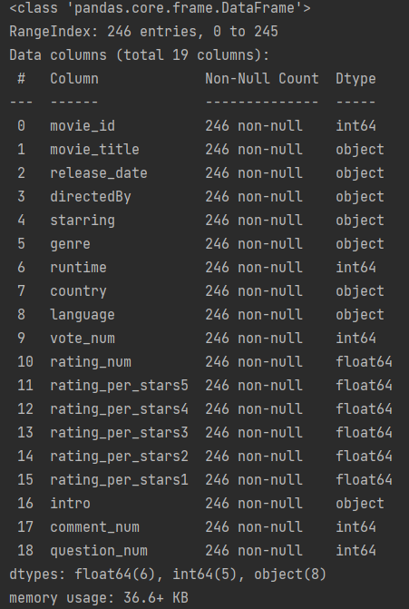
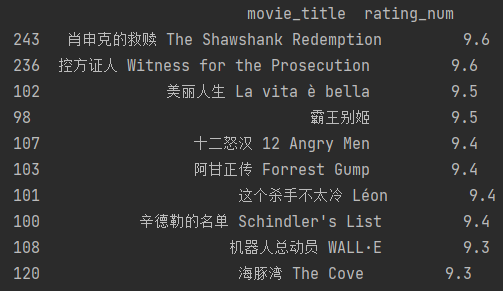
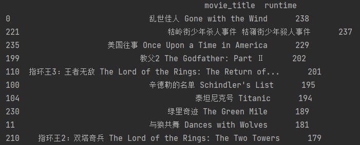
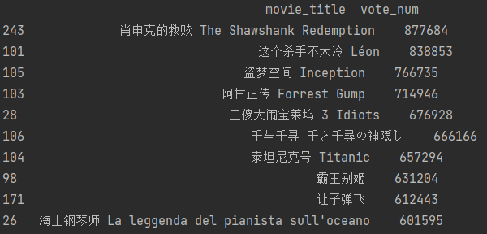
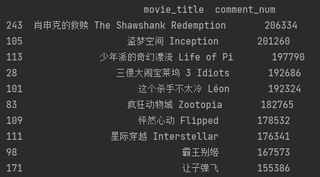
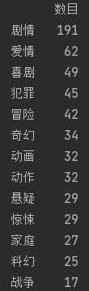
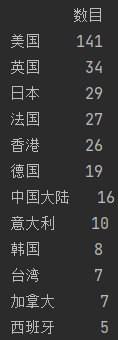
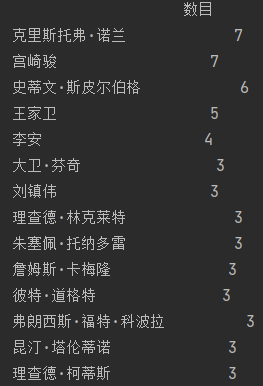
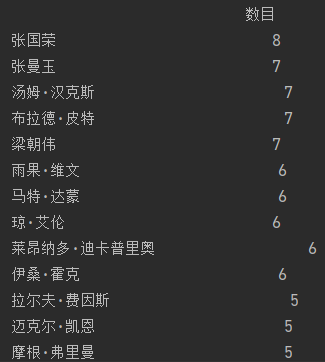

# 项目----豆瓣top250数据分析
数据清理 + 数据分析 + Echarts可视化 + 构建情感分析模型
- ## 1. 数据清洗
  - a.数据的读取和查看基本信息
  - b.对每列数据确定类型以及深入清洗,包括空值，异常值，重复值，时间格式，文本格式的处理
  - c.将处理好的数据整理为新的dataframe用于数据分析，并保留原始的数据作为备份
```
import pandas as pd

# pd.set_option('display.max_columns', None)   # 用于展示所有列
# pd.set_option('display.max_rows', None)  # 用以显示所有行


def read_json_file(file):
    """
    该函数是数据清洗的第一步，作用是读取数据，并将该数据源转换为dataframe并展示基本的信息，包括数据的大小形状，
    列名，每列的数据类型，是否有空值，以及前5行的详细信息
    :param file: 输入的是需要读取的文件地址
    :return: 输出的是dataframe，包含该dataframe的基本信息
    """
    movie_item = pd.read_json(file, lines=True)  # 其中lines=True表示一个文件里面有多个字典
    print(movie_item.info())
    return movie_item


def clean_movie(data):
    """
    该函数是进行数据清洗工作的函数，主要作用是对每一列数据进行清洗，确认每一列列的数据类型、处理缺失值，异常值、对文本类字符串进行提取
    :param data: 输入的是需要进行清洗的dateframe
    :return: 返回已经清洗完成的数据
    """
    data_movie = data
    # 对数据进行清理，确定每一个字段的数据类型，字符串、整形、浮点型、时间类型等
    data_movie["country"] = data_movie["country"].apply(lambda x: x.replace(' /', '').split(" "))  # 对字符串进行特换，拆分之后为列表
    data_movie["vote_num"] = data_movie["vote_num"].apply(lambda x: int(x[0]))  # 对评论数量进行清洗
    data_movie["movie_title"] = data_movie["movie_title"].apply(lambda x: (x[0]))
    data_movie["starring"] = data_movie["starring"]
    data_movie["comment_num"] = data_movie["comment_num"].apply(lambda x: int(x[3:-2]))
    data_movie["rating_per_stars5"] = data_movie["rating_per_stars5"].apply(lambda x: float(x[:-1])*0.01)  # 对百分比进行提取
    data_movie["rating_per_stars4"] = data_movie["rating_per_stars4"].apply(lambda x: float(x[:-1])*0.01)
    data_movie["rating_per_stars3"] = data_movie["rating_per_stars3"].apply(lambda x: float(x[:-1])*0.01)
    data_movie["rating_per_stars2"] = data_movie["rating_per_stars2"].apply(lambda x: float(x[:-1])*0.01)
    data_movie["rating_per_stars1"] = data_movie["rating_per_stars1"].apply(lambda x: float(x[:-1])*0.01)
    data_movie["language"] = data_movie["language"]
    data_movie["directedBy"] = data_movie["directedBy"]
    data_movie["movie_id"] = data_movie["movie_id"].apply(lambda x: int(x[0][3:-1]))  # 对电影id进行提取，提取列表中第一个元素的后几位数字编号
    data_movie["release_date"] = data_movie["release_date"].apply(lambda x: (x[0][1:5]))
    data_movie["rating_num"] = data_movie["rating_num"].apply(lambda x: float(x[0]))
    data_movie["genre"] = data_movie["genre"]
    # 下面这三个字段需要进一步做数据清理
    # 在处理runtime时发现该列有空值，并且不是所有行都是数字开头的，所以需要单独处理
    data_movie.loc[15, 'runtime'] = [['82分钟']]   # 经过数据清洗，发现runtime列的15行有空值，对空值进行填充,原数据是以列表的形式存在的，所以赋值时也用列表赋值
    data_movie["runtime"] = data_movie["runtime"].apply(lambda x: int(re.search(r'\d+', (x[0])).group()))
    data_movie["question_num"] = data_movie["question_num"].apply(lambda x: int(re.search(r'\d+', x).group()))
    data_movie["intro"] = data_movie["intro"].apply(lambda x: (str(x[0]).strip()))
    # 对处理好的数据进行重新排序
    data_movie = data_movie[["movie_id", "movie_title", "release_date", "directedBy", "starring", "genre", "runtime",
                             "country", "language", "vote_num", "rating_num", "rating_per_stars5", "rating_per_stars4",
                             "rating_per_stars3", "rating_per_stars2", "rating_per_stars1", "intro", "comment_num", "question_num"]]

    return data_movie
    
# 1.数据清洗：a.数据的读取和查看基本信息
data_movie = read_json_file("./static/data/movie_item.json")
# 2.数据清洗：b.对每列数据深入清洗：确定数据类型以及空值，异常值，重复值，时间格式，文本格式的处理
data_movie = clean_movie(data_movie)
```
经过上诉读取和清洗，得到的数据如下：




- ## 2. 数据分析
  - 描述性统计分析
  - 相关性分析
  - 模型预测分析
  - ###  描述性统计分析
```
class MovieAnalysis:
    list_genre = []
    """这是一个数据分析的类，包含各列排行前10"""
    def __init__(self, date_movie):
        self.date_movie = date_movie

    def movie_sort(self, name):
        """
        这是定义了一个排序的方法，用于对电影进行排序，date.sort_values() 该方法是dateframe中的排序方法
        :param name: 输入需要排序的列，经过date.sort_values()的降序排列，提取排行前10的数据
        :return: 返回排行前10的电影标题和对应的数据
        """
        movie_sort_name = self.date_movie.sort_values(name, ascending=False)[["movie_title", name]].head(10)
        print(movie_sort_name)

    def count_list(self, colums):
        """
        这个方法是统计ddateframe中某一列列表中元素出现的次数
        思路：
            1. 将每一列的列表合并，放进一个大的列表中
            2. 在大的列表中计算出每一个元素出现的次数
            3. 排序，输出 pd.value_counts()函数，可以快速统计列表中的元素个数，并排序
        :return: 返回统计结果
        """
        for index_name, rows in self.date_movie.iterrows():
            if type(rows[colums]) is list:
                self.list_genre.extend(rows[colums])
                count_res = pd.value_counts(self.list_genre)
            else:
                count_res = type(rows[colums])
        count_res = pd.DataFrame(count_res, columns=["数目"])
        return count_res
```  
   - 首先我为了方便美观，我建立了一个数据分析的类，有关的分析方法全部写在类中，这样做也许不能使代码变得简洁，但是
     却能美观，不用过很长时间后看代码的时候不知道顺序
   - 其次在类中定义的方法可以直接实例化一个对象，传入需要分析的数据文件就可以了
   - 实例化对象,后续分析直接用对象.方法就可以了
```
data_movie_analysis = MovieAnalysis(data_movie)  # 创建一个类，将date数据传入，定义方法进行详细分析。
```     
- ### 2.1 总评分最高的前10部电影
```
data_movie_analysis.movie_sort("rating_num")
```  


  - 《肖申克的救赎》排名第一，评分高达9.6分
- ### 2.2 根据电影时间长的电影排行榜
```
data_movie_analysis.movie_sort("runtime")
```  


   - 在时长排名的前十中并非所有都是耳熟能详的电影，所以我想知道电影时长和电影评分有没有关系

- ### 2.3 根据电影评分人数的电影排行榜
```
data_movie_analysis.movie_sort("vote_num")
```  


- ### 2.4  根据电影评价数的电影排名
```
data_movie_analysis.movie_sort("comment_num")
```  


  - 从直接观察发不难看出电影评分人数和电影评价数有很大的相关性，那么我想知道这两者之间的相关系数是多少
  - 如果评分人数和评价数有很强的正相关关系，那么可以说明愿意给电影打分的人也会愿意给电影评论，我想知道评分和评论的转化率
  - 另外我想知道，评分高低对评价数有影响吗？比如说打高分的人更愿意评论还是打低分的人更愿意评论，还是愿意打分的都会评论

- ### 2.5 最受欢迎的电影类型
  接下来，将分别分析最受欢迎的电影类型genre、电影出品国家country、导演directedBy、演员starring、电影语言language。
   - 由于电影类型，国家等不是一个，所以需要对该列进行循环统计，计数，排序等操作。
```
data_movie_analysis.count_list("genre")
```  


   - 好莱坞的传统，通常剧情片更容易得到大部分观众的认可，不过爱情片居然有这么多是我没有想到的

- ### 2.6 最受欢迎的电影出品国家排行榜
```
data_movie_analysis.count_list("country")
```  


   - 毫无疑问，好莱坞大片在质量与成熟度上都远优于其他国家，但是我国的电影业也是蓬勃发展，期待
     超过好莱坞的一天
     
- ### 2.7 最受欢迎的电影导演名单
```
data_movie_analysis.count_list("directedBy")
```    

- ### 2.8 最受欢迎的电影演员名单
```
data_movie_analysis.count_list("starring")
```    


  - 让我没有想到的是张国荣居然排在第一，不经让我很想知道他都出演了哪些电影。
- ## 3. Echarts可视化
- ## 4. 构建模型

