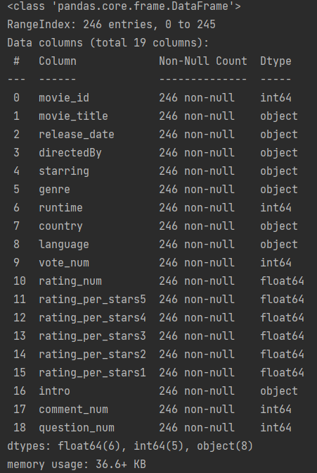

# 项目----豆瓣top250数据分析
数据清理 + 数据分析 + Echarts可视化 + 构建情感分析模型
- ## 1. 数据清洗
  - a.数据的读取和查看基本信息
  - b.对每列数据确定类型以及深入清洗,包括空值，异常值，重复值，时间格式，文本格式的处理
  - c.将处理好的数据整理为新的dataframe用于数据分析，并保留原始的数据作为备份
```
import pandas as pd

# pd.set_option('display.max_columns', None)   # 用于展示所有列
# pd.set_option('display.max_rows', None)  # 用以显示所有行


def read_json_file(file):
    """
    该函数是数据清洗的第一步，作用是读取数据，并将该数据源转换为dataframe并展示基本的信息，包括数据的大小形状，
    列名，每列的数据类型，是否有空值，以及前5行的详细信息
    :param file: 输入的是需要读取的文件地址
    :return: 输出的是dataframe，包含该dataframe的基本信息
    """
    movie_item = pd.read_json(file, lines=True)  # 其中lines=True表示一个文件里面有多个字典
    print(movie_item.info())
    return movie_item


def clean_movie(data):
    """
    该函数是进行数据清洗工作的函数，主要作用是对每一列数据进行清洗，确认每一列列的数据类型、处理缺失值，异常值、对文本类字符串进行提取
    :param data: 输入的是需要进行清洗的dateframe
    :return: 返回已经清洗完成的数据
    """
    data_movie = data
    # 对数据进行清理，确定每一个字段的数据类型，字符串、整形、浮点型、时间类型等
    data_movie["country"] = data_movie["country"].apply(lambda x: x.replace(' /', '').split(" "))  # 对字符串进行特换，拆分之后为列表
    data_movie["vote_num"] = data_movie["vote_num"].apply(lambda x: int(x[0]))  # 对评论数量进行清洗
    data_movie["movie_title"] = data_movie["movie_title"].apply(lambda x: (x[0]))
    data_movie["starring"] = data_movie["starring"]
    data_movie["comment_num"] = data_movie["comment_num"].apply(lambda x: int(x[3:-2]))
    data_movie["rating_per_stars5"] = data_movie["rating_per_stars5"].apply(lambda x: float(x[:-1])*0.01)  # 对百分比进行提取
    data_movie["rating_per_stars4"] = data_movie["rating_per_stars4"].apply(lambda x: float(x[:-1])*0.01)
    data_movie["rating_per_stars3"] = data_movie["rating_per_stars3"].apply(lambda x: float(x[:-1])*0.01)
    data_movie["rating_per_stars2"] = data_movie["rating_per_stars2"].apply(lambda x: float(x[:-1])*0.01)
    data_movie["rating_per_stars1"] = data_movie["rating_per_stars1"].apply(lambda x: float(x[:-1])*0.01)
    data_movie["language"] = data_movie["language"]
    data_movie["directedBy"] = data_movie["directedBy"]
    data_movie["movie_id"] = data_movie["movie_id"].apply(lambda x: int(x[0][3:-1]))  # 对电影id进行提取，提取列表中第一个元素的后几位数字编号
    data_movie["release_date"] = data_movie["release_date"].apply(lambda x: (x[0][1:5]))
    data_movie["rating_num"] = data_movie["rating_num"].apply(lambda x: float(x[0]))
    data_movie["genre"] = data_movie["genre"]
    # 下面这三个字段需要进一步做数据清理
    # 在处理runtime时发现该列有空值，并且不是所有行都是数字开头的，所以需要单独处理
    data_movie.loc[15, 'runtime'] = [['82分钟']]   # 经过数据清洗，发现runtime列的15行有空值，对空值进行填充,原数据是以列表的形式存在的，所以赋值时也用列表赋值
    data_movie["runtime"] = data_movie["runtime"].apply(lambda x: int(re.search(r'\d+', (x[0])).group()))
    data_movie["question_num"] = data_movie["question_num"].apply(lambda x: int(re.search(r'\d+', x).group()))
    data_movie["intro"] = data_movie["intro"].apply(lambda x: (str(x[0]).strip()))
    # 对处理好的数据进行重新排序
    data_movie = data_movie[["movie_id", "movie_title", "release_date", "directedBy", "starring", "genre", "runtime",
                             "country", "language", "vote_num", "rating_num", "rating_per_stars5", "rating_per_stars4",
                             "rating_per_stars3", "rating_per_stars2", "rating_per_stars1", "intro", "comment_num", "question_num"]]

    return data_movie
    
# 1.数据清洗：a.数据的读取和查看基本信息
data_movie = read_json_file("./static/data/movie_item.json")
# 2.数据清洗：b.对每列数据深入清洗：确定数据类型以及空值，异常值，重复值，时间格式，文本格式的处理
data_movie = clean_movie(data_movie)
```
经过上诉读取和清洗，得到的数据如下：


- ## 2. 数据分析
- ## 3. Echarts可视化
- ## 4. 构建模型

